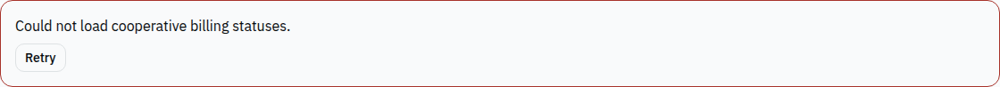

# Phase D2: confirm cooperative billing status changes

Replaces the cross-cooperative paying badge with an accessible switch. A confirmation names the cooperative and proposed status before PATCH. The row changes only after success; failed calls preserve the old value and allow retry. Duplicate submissions are locked. Summary loading failures now show a retry action.

Validation: production build passed. Live SUPER_ADMIN login succeeded, but `GET /admin/cooperatives/summary` returned 404. No billing records were modified.

**Blocked live acceptance:** the table cannot load on the running backend, so the toggle/confirmation/PATCH round trip is unverified. Deploy the existing summary and billing endpoints and retest cancellation, success, failure and reversal before marking ready.

Reproduce: SUPER_ADMIN Dashboard → cross-cooperative summary → change Paying → cancel once, then confirm; reload to verify persistence and restore the test cooperative’s original status.

All new UI text is in react-i18next English, Kinyarwanda and French locale keys. No backend or mobile source was changed. Each branch starts independently from `9d462f6d`; none requires another Phase D PR. The shared layout gets `min-w-0` so content can shrink on mobile; sidebar Sheet behavior is unchanged. The pre-existing header still extends about 26px past a 390px viewport and is outside these feature changes.

Verification used the supplied local test accounts and `http://localhost:8089`. Synthetic test records described above remain as verification fixtures. Existing bundle-size warnings remain; builds have zero errors.

### Live evidence

