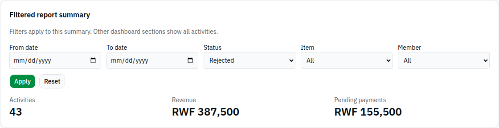
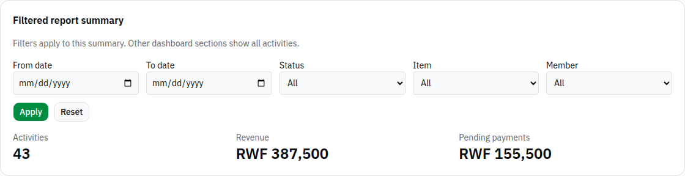
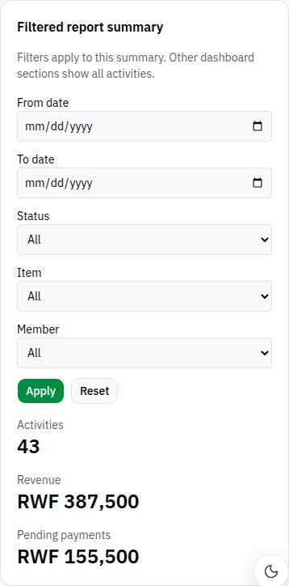

# Phase D1: add filtered cooperative report summary

Adds a separate report summary with date, status, item and member filters. Empty filters preserve the no-query request. Other dashboard metrics are explicitly outside the filter scope. Requests have loading/error states and ignore stale responses.

Validation: production build passed. Live browser sent `GET /reports/summary?status=REJECTED` (200); Reset sent the no-query URL. English, French and Kinyarwanda labels were checked. Screenshots include desktop and 390px report layout.

**Blocked live acceptance:** the running backend returned 43 activities for REJECTED while the activity list contained 8 rejected rows. It currently ignores this filter. The frontend does not recalculate or fake filtered totals. Retest with the current backend deployed before marking ready.

Reproduce: sign in as COOP_ADMIN, open Dashboard, select a status and Apply; inspect the request and returned totals, then Reset. Also exercise date bounds and item/member selectors.

All new UI text is in react-i18next English, Kinyarwanda and French locale keys. No backend or mobile source was changed. Each branch starts independently from `9d462f6d`; none requires another Phase D PR. The shared layout gets `min-w-0` so content can shrink on mobile; sidebar Sheet behavior is unchanged. The pre-existing header still extends about 26px past a 390px viewport and is outside these feature changes.

Verification used the supplied local test accounts and `http://localhost:8089`. Synthetic test records described above remain as verification fixtures. Existing bundle-size warnings remain; builds have zero errors.

### Live evidence

