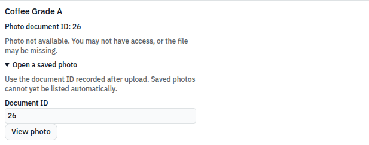
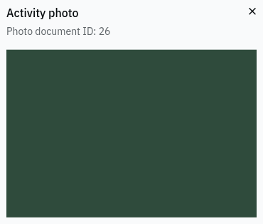

# Phase D updates merged in this branch

## Phase D1: add filtered cooperative report summary

Adds a separate report summary with date, status, item and member filters. Empty filters preserve the no-query request. Other dashboard metrics are explicitly outside the filter scope. Requests have loading/error states and ignore stale responses.

Validation: production build passed. Live browser sent `GET /reports/summary?status=REJECTED` (200); Reset sent the no-query URL. English, French and Kinyarwanda labels were checked. Screenshots include desktop and 390px report layout.

**Blocked live acceptance:** the running backend returned 43 activities for REJECTED while the activity list contained 8 rejected rows. It currently ignores this filter. The frontend does not recalculate or fake filtered totals. Retest with the current backend deployed before marking ready.

Reproduce: sign in as COOP_ADMIN, open Dashboard, select a status and Apply; inspect the request and returned totals, then Reset. Also exercise date bounds and item/member selectors.

## Phase D6: add activity photo upload and document viewer

Adds an optional image file to activity creation and upload/retry controls on existing activities. Uploads use multipart field `file`; images are fetched through the authenticated document-file endpoint as blobs, displayed as expandable thumbnails and cleaned up on unmount. A failed photo upload does not resubmit the saved activity. File type/size validation, loading states and localized unavailable states are included.

Validation: production build passed. Real browser creation returned 201 (activity #103); multipart upload returned 200 (document #26); the downloaded image loaded and expanded. A different member’s retrieval was denied by the running backend with **500**, not the specified 403; the UI displayed unavailable with no broken image. No API responses were mocked.

**Incomplete requirement:** activity responses contain no photo/document ID, and there is no activity-to-documents listing endpoint. Newly uploaded photos can be viewed in the current screen. A clearly labeled document-ID lookup is the stopgap for saved photos. Automatic historical photo discovery and the genuine 403 acceptance check remain blocked; do not call this full gap closure.

Reproduce: record an activity with a small JPEG/PNG/WebP, inspect its thumbnail and expand it; record the document ID, then open it after navigation. Use an unrelated member to verify unavailable. Verify upload retry does not create another activity.

All new UI text is in react-i18next English, Kinyarwanda and French locale keys. No backend or mobile source was changed. Each branch starts independently from `9d462f6d`; none requires another Phase D PR. The shared layout gets `min-w-0` so content can shrink on mobile; sidebar Sheet behavior is unchanged. The pre-existing header still extends about 26px past a 390px viewport and is outside these feature changes.

Verification used the supplied local test accounts and `http://localhost:8089`. Synthetic test records described above remain as verification fixtures. Existing bundle-size warnings remain; builds have zero errors.

### Live evidence

