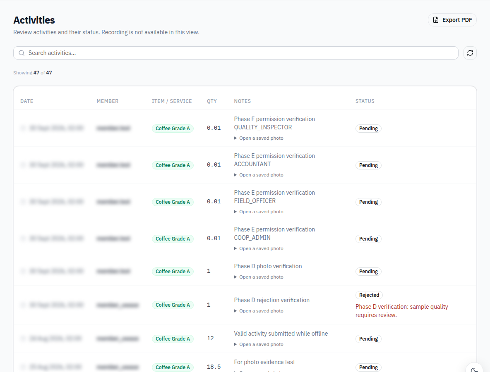
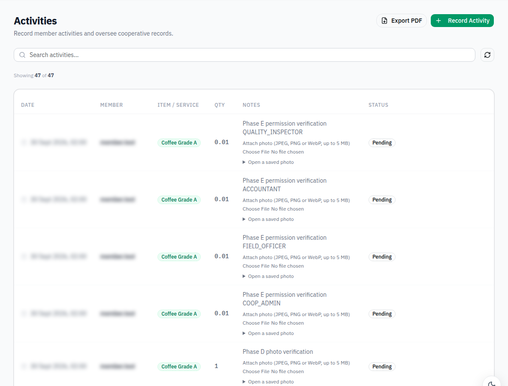
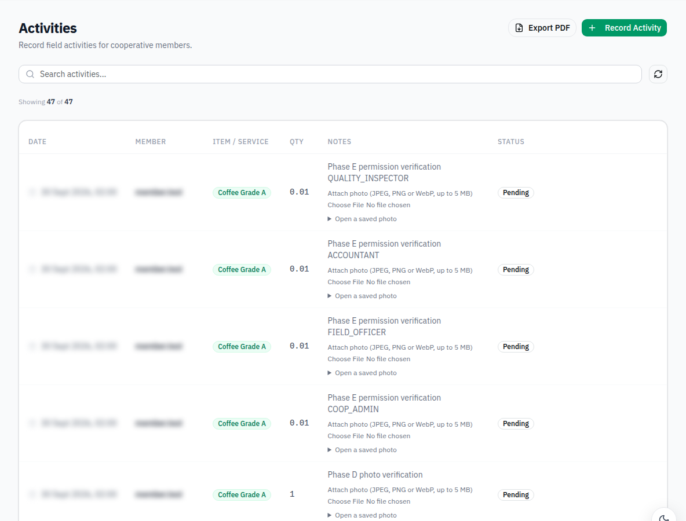
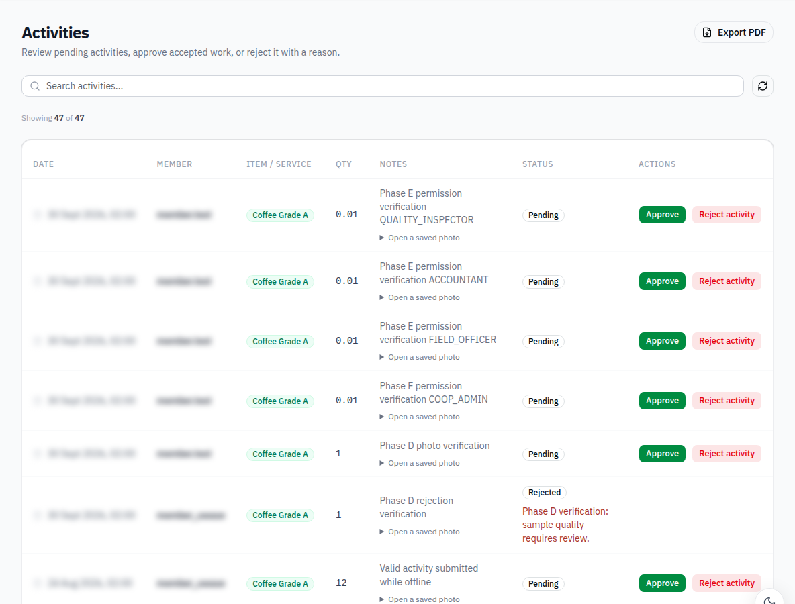

# Phase E5: differentiate activity recording and inspection views

Adds role-specific Activities guidance and controls. COOP_ADMIN/FIELD_OFFICER retain recording and uploads; ACCOUNTANT gets read-only rows; QUALITY_INSPECTOR gets prominent approve/reject actions and a required rejection-reason dialog. The recording dialog itself is conditionally mounted, and open/submit handlers are guarded. Existing authenticated photo viewing remains available. Review responses update the row, with per-action error handling and duplicate-submission protection.

Live permission probes used valid synthetic activities in the test cooperative:

| Role | POST /activities | Record UI | Review UI |
|---|---:|---|---|
| COOP_ADMIN | 201 | Yes | No |
| FIELD_OFFICER | 201 | Yes | No |
| ACCOUNTANT | 201 | No | No |
| QUALITY_INSPECTOR | 201 | No | Yes |

**Authorization finding:** the running backend accepts recording from all four roles. None returned 403 with a valid request. The requested UI responsibilities are deliberately narrower than those backend permissions; this PR does not claim to enforce server-side authorization or alter it.

Validation: production build passes. Four actual role screenshots are included; member identities are blurred for publication. The inspector rejected test activity #107 with a nonempty reason (200), displayed the returned reason, and approved test activity #106 (200). The empty rejection form cannot submit. Synthetic permission activities #104–107 remain as test records. The unused temporary inspector account was removed after the supplied inspector login became available.

Frontend only. No backend or mobile source changes. All newly added text uses EN/RW/FR react-i18next keys. Builds retain the existing bundle-size warnings but have no errors. Screenshots use the live local backend; personal names are blurred where shown.

## Evidence

