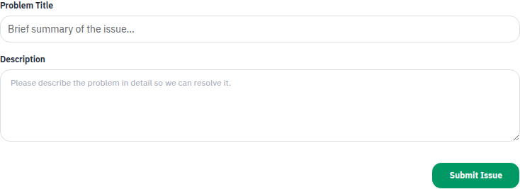

# Phase E1: remove retired issue and translation code

Removes the unrouted `RaiseIssue.jsx`, its custom `useTranslate`/`LanguageContext` stack, and the four old flat locale JSON files used only by that stack. Removes the duplicate `/my-activities` route and its header label; neither sidebar had a matching entry.

Reference searches confirmed `RaiseIssue` was the only custom-hook consumer. The routed `/report-problem` still uses `RaiseProblem`; verification found that page imported `useTranslation` but never bound `t`, so this PR adds that missing binding rather than leaving the retained page broken.

Validation: production build passes; source searches find no retired imports or route references. MEMBER `/report-problem` renders its form in modern and legacy modes. `/my-activities` follows the existing unknown-route redirect. The active react-i18next resources remain intact.

Frontend only. No backend or mobile source changes. All newly added text uses EN/RW/FR react-i18next keys. Builds retain the existing bundle-size warnings but have no errors. Screenshots use the live local backend; personal names are blurred where shown.

## Evidence

