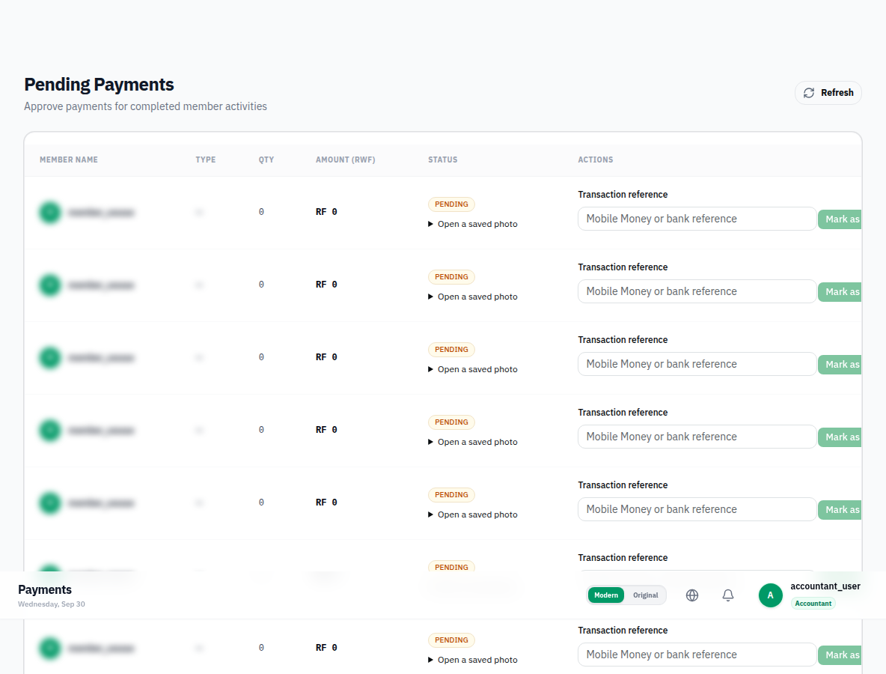

# Phase E2: require transaction references for payment processing

Both payment screens sent an empty reference. A shared reference action now requires non-whitespace text in legacy, desktop and mobile renderings, trims it, disables duplicate submission and retains input on errors. Both handlers guard the value, and the payment service rejects missing references before sending a request. Axios query parameters preserve special characters. The existing Payments page’s missing `t` binding is also corrected.

Live contract check on a nonexistent payment ID: omitting `reference` returned 400; sending `reference=` reached payment lookup and returned 404. Thus omitted and empty differ, and the backend does not enforce nonblank input at parameter binding. This UI deliberately requires a reference; it supplies no invented default.

Validation: production build passes. Empty and whitespace-only input kept the action disabled. The live browser marked synthetic local payment #54 PAID with the reference below. The response and a subsequent GET both returned that exact reference. This is a QA ledger reference, not a claim of an external Mobile Money settlement; the inspected operation updates the ledger rather than initiating a transfer.

```http
PATCH /api/v1/payments/54/pay?reference=SC-QA-20260930-54%2FA%26B
Content-Type: application/json

null
```

Response: 200; persisted status: `PAID`; persisted reference: `SC-QA-20260930-54/A&B`. See `request.json` for captured request details without authentication headers.

Frontend only. No backend or mobile source changes. All newly added text uses EN/RW/FR react-i18next keys. Builds retain the existing bundle-size warnings but have no errors. Screenshots use the live local backend; personal names are blurred where shown.


## Evidence


