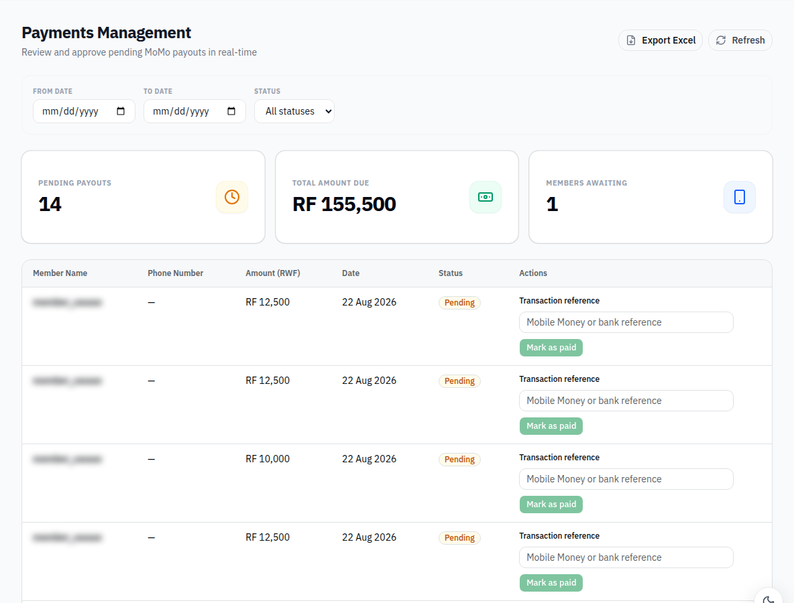
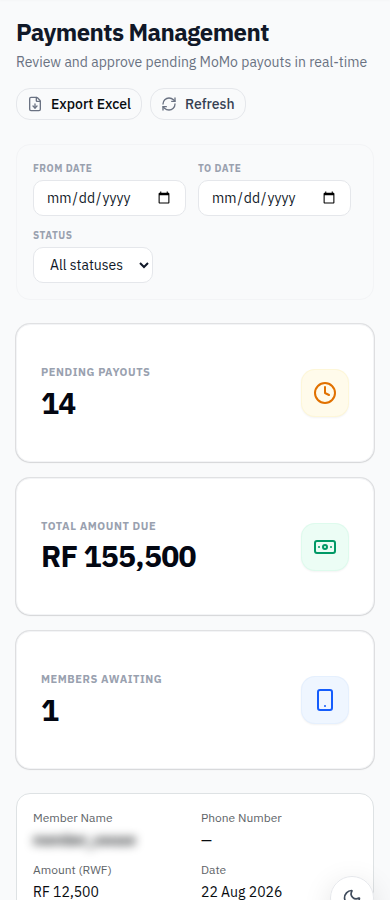
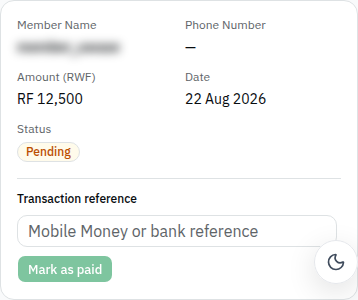

# Phase E3: share payment table and mobile-row rendering

Extracts `PaymentTable` and shared status rendering, using Phase A `ResponsiveTable` for desktop/legacy layouts and a common mobile card renderer. Each page supplies its own columns, callbacks and processing state. Fetching and exports stay in the pages. This removes six duplicated table/card implementations while preserving merged photo-view controls and the reference requirement.

`Payments` remains the pending oversight screen; only an ACCOUNTANT can supply its processing action. `PaymentsManagement` retains accountant processing, date/status export controls and Excel export. The export label now evaluates its existing translation key rather than displaying the source expression literally.

**Stacked PR:** based on the transaction-reference PR so this diff contains rendering extraction rather than another copy of the reference fix. Merge that PR first, then retarget this PR to main if GitHub has not done so.

Validation: production build passes. Accountant desktop/mobile at 1440px and 390px, in both modern and legacy modes, render the shared payment views. Real Excel export returned 200. No API responses were mocked.

**API/scope limitation — draft:** the current code and live API provide pending payments, not a cooperative-wide all-payments list. `/payments` returns 404, `/payments/all` is interpreted as an invalid ID, and COOP_ADMIN `/payments/pending` returns 403. This refactor preserves the existing queries and the accountant export (which can include other statuses); it does not invent an all-payments endpoint or claim successful cooperative-admin access. A confirmed supported endpoint or acceptance of the existing data scope is needed for that part of the requested behavior.

Frontend only. No backend or mobile source changes. All newly added text uses EN/RW/FR react-i18next keys. Builds retain the existing bundle-size warnings but have no errors. Screenshots use the live local backend; personal names are blurred where shown.

## Evidence

