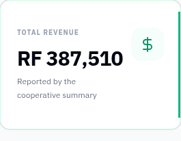
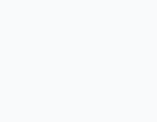
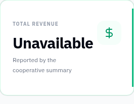

# Phase E4: use report API as the sole revenue source

Removes the activity-derived revenue sum and item-price fallback. The revenue card reads only `getReportSummary().data.totalRevenue`. Its request has independent loading, error, retry and stale-response guards. The Phase A StatCard skeleton shows while waiting; failure or malformed revenue shows Unavailable rather than a local estimate or fabricated zero. Currency formatting retains up to two decimal places. Pending-summary display follows the same loading/error lifecycle.

Validation: production build passes. The live API returned `totalRevenue: 387510` and the card displayed `RF 387,510`. Holding the genuine request before sending it left the revenue card in its skeleton state with no number. Releasing that request displayed its actual returned value. Aborting a separate request produced Unavailable. Source review confirms no activity/price revenue reducer remains. Tests did not substitute API response bodies.

Frontend only. No backend or mobile source changes. All newly added text uses EN/RW/FR react-i18next keys. Builds retain the existing bundle-size warnings but have no errors. Screenshots use the live local backend; personal names are blurred where shown.

## Evidence

